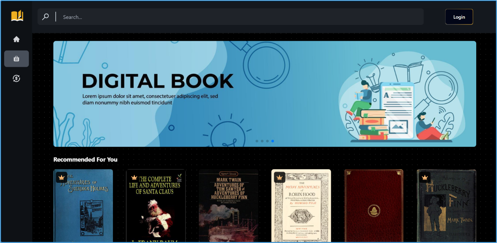

# `MetaReads`

Metareads is an innovative web application for reading books online, built on advanced Web3 technology, ICP (Internet Computer Protocol), Internet Identity, and Artificial Intelligence. Designed for accessibility, Metareads allows users to read seamlessly across smartphones, laptops, computers, and other devices. With powerful AI integration, users can summarize paragraphs, making it easier to grasp key ideas and enhance their reading experience.

There are 6 main features in Metareads.

- **Authentication using Internet Identity**: Metareads has implemented ICP Internet Identity to help users securely and seamlessly log in to the website.
- **Subscription Based Model**: Metareads offers multiple tiers of subscription options to facilitate diverse reading needs and budgets, allowing users to access a range of content based on their chosen plan.
- **Online Reading**: Metareads allows users to read books directly on the website providing easy access anywhere. User reading history is automatically saved, including total time spent reading and the last page accessed.
- **AI-Powered Summarization**: Instantly summarize books or specific paragraphs using integrated artificial intelligence.
- **Library Management and Customization**: Metareads enables users to personalize their library, giving them complete control over organizing and customizing their library page.
- **Book Reviews**: Metareads allows users to leave reviews for books they’ve read, providing other readers with insights and recommendations.

To get started, you might want to explore the project directory structure and the default configuration file. Working with this project in your development environment will not affect any production deployment or identity tokens.

To learn more before you start working with `MetaReads`, see the following documentation available online:

- [Quick Start](https://internetcomputer.org/docs/current/developer-docs/setup/deploy-locally)
- [SDK Developer Tools](https://internetcomputer.org/docs/current/developer-docs/setup/install)
- [Rust Canister Development Guide](https://internetcomputer.org/docs/current/developer-docs/backend/rust/)
- [ic-cdk](https://docs.rs/ic-cdk)
- [ic-cdk-macros](https://docs.rs/ic-cdk-macros)
- [Candid Introduction](https://internetcomputer.org/docs/current/developer-docs/backend/candid/)

If you want to start working on your project right away, you might want to try the following commands:

```bash
cd MetaReads/
dfx help
dfx canister --help
```

## Running the project locally

If you want to test your project locally, you can use the following commands:

```bash
# Starts the replica, running in the background
dfx start --background

# Deploys your canisters to the replica and generates your candid interface
dfx deploy
```

Once the job completes, your application will be available at `http://localhost:4943?canisterId={asset_canister_id}`.

If you have made changes to your backend canister, you can generate a new candid interface with

```bash
npm run generate
```

at any time. This is recommended before starting the frontend development server, and will be run automatically any time you run `dfx deploy`.

If you are making frontend changes, you can start a development server with

```bash
npm start
```

Which will start a server at `http://localhost:8080`, proxying API requests to the replica at port 4943.

##### Note on frontend environment variables

## Guest Interface

As a guest, the guest only has a limited number of options that they can do on the website. Guests can interact with the 5 main pages, home page, store page, book detail page, login page, and subscription page. Below is the figure for each page.

#### Dashboard Screen


#### Store Screen



#### Subscription Screen


#### Book Detail Screen


#### Read Page (Guest) Screen


#### Login Screen


## User Interface

#### Register Screen

After the user has logged in, the user can access all of the main features of Metareads. When the user has logged in, if the user does not have an account registered. It will ask users to register a unique username.


#### Library Screen

Once the user has logged in, there is a new page in the sidebar. This page is a library page. This page has multiple functionalities that allow users to customize their own library starting from adding a new book, searching their library and managing each of their libraries.


#### Add New Library Screen


#### Remove Library Screen


#### Book Detail (User) Screen

When the user that has logged in wants to read a book, they have multiple options that they can choose from. They can directly read a book, or they want to add those books to their library, so they can continue to read the book or add the book into read list. Users also be able to track their total reading time for the book and leave a review for the book that they have read.


#### Add To Library Screen


#### Library Page (With Inserted Book) Screen


#### Read Page (Free User) Screen

If the users don’t have the required subscription to read the book, the user will be asked to upgrade their subscription tier using the subscription page before they can continue reading the book.


#### Subscription (User) Screen

In the subscription page, users can choose between monthly and yearly plan based on the user needs. In general, the plan was separated into 3 tiers which are Free, Standard, and Premium plan with each tier having their own benefit and uniqueness. All new registered user will always start with Free plan.


After the user has the required subscription tier, user can continue to read the book. With Standard and Premium subscriptions tier, users can use the AI Summarizer feature in read page. Users can block the text that they want to summarize and then the summarize button will appear in the top right.

#### Read Page (Premium with AI) Screen


#### Summarizer Screen


## Admin Interface

Admin has the capability to manage all the distributed books for the website. In general, admin has 3 additional pages which are genre, author and book mangement pages. Each of these pages has the same general functionality to Create, Read, Update and Delete the book data for the website. Admin has full responsibility to control the genre, author and the subscription tier for each book that will be distributed for user to read.

#### Genre Page (Admin) Screen


#### Author Page (Admin) Screen


#### Book Management (Admin) Screen


## Book Reference

#### Get all books

```http
get_all_book(page, limit, query)
```

| Parameter | Type     | Description   |
| :-------- | :------- | :------------ |
| `page`    | `usize`  | **Required**. |
| `limit`   | `usize`  | **Required**. |
| `query`   | `String` | **Optional**. |

Return array of books

Return Ex:

book = {
id,
title,
description,
cover_image,
author: {id, name},
genre: {id, name},
plan,
views,
page_count,
created_at,
updated_at,
}

[
book1, book2, book3
]

#### Get book

```http
get_book({id})
```

| Parameter | Type        | Description   |
| :-------- | :---------- | :------------ |
| `id`      | `Principal` | **Required**. |

Return Book or Error

#### Get Popular Book

```http
get_popular_book()
```

Return 10 books with the most views

#### Get Latest Release Book

```http
get_latest_release_book()
```

Return 20 books with the newest release

#### Get Book By Genre

```http
get_book_by_genre({genre_id})
```

| Parameter  | Type        | Description   |
| :--------- | :---------- | :------------ |
| `genre_id` | `Principal` | **Required**. |

Return books filtered by the genre

#### Create Book

```http
create_book({title, description, cover_image, author_id, genre_id, plan, page_count})
```

| Parameter     | Type        | Description   |
| :------------ | :---------- | :------------ |
| `title`       | `string`    | **Required**. |
| `description` | `string`    | **Required**. |
| `cover_image` | `string`    | **Required**. |
| `author_id`   | `Principal` | **Required**. |
| `genre_id`    | `Principal` | **Required**. |
| `plan`        | `string`    | **Required**. |
| `page_count`  | `i64`       | **Required**. |

Return Book or Error

#### Update Book

```http
update_book({id, title, description, cover_image, author_id, genre_id, plan, page_count})
```

| Parameter     | Type        | Description   |
| :------------ | :---------- | :------------ |
| `id`          | `Principal` | **Required**. |
| `title`       | `string`    | **Required**. |
| `description` | `string`    | **Required**. |
| `cover_image` | `string`    | **Required**. |
| `author_id`   | `Principal` | **Required**. |
| `genre_id`    | `Principal` | **Required**. |
| `plan`        | `string`    | **Required**. |
| `page_count`  | `i64`       | **Required**. |

Return Book or Error

#### Delete Book

```http
delete_book({id})
```

| Parameter | Type        | Description   |
| :-------- | :---------- | :------------ |
| `id`      | `Principal` | **Required**. |

Return Book or Error

## User Reference

#### Create User

```http
create_user({username, password})
```

| Parameter  | Type     | Description   |
| :--------- | :------- | :------------ |
| `username` | `string` | **Required**. |
| `password` | `string` | **Required**. |

Return User or Error

#### Update User

```http
update_user({id, username, password, image, money})
```

| Parameter  | Type        | Description   |
| :--------- | :---------- | :------------ |
| `id`       | `Principal` | **Required**. |
| `username` | `string`    | **Required**. |
| `password` | `string`    | **Optional**. |
| `image`    | `string`    | **Optional**. |
| `money`    | `u64`       | **Optional**. |

Return User or Error

#### Get User

```http
get_user({id})
```

| Parameter | Type        | Description   |
| :-------- | :---------- | :------------ |
| `id`      | `Principal` | **Required**. |

Return User or Error
User{
id,
username,
password,
image,
money,
subscription{
plan{
name
}
}
}

#### Login

```http
login({username, password})
```

| Parameter  | Type     | Description   |
| :--------- | :------- | :------------ |
| `username` | `string` | **Required**. |
| `password` | `string` | **Required**. |

Return User or Error

#### Get User Count

```http
get_user_count()
```

Return number or Error

## Genre Reference

#### Create Genre

```http
create_genre({name})
```

| Parameter | Type     | Description   |
| :-------- | :------- | :------------ |
| `name`    | `string` | **Required**. |

Return Genre or Error

#### Get All Genre

```http
get_all_genre()
```

Return array of genre

#### Update Genre

```http
update_genre({id, name})
```

| Parameter | Type        | Description   |
| :-------- | :---------- | :------------ |
| `id`      | `Principal` | **Required**. |
| `name`    | `string`    | **Required**. |

Return Genre or Error

#### Delete Genre

```http
delete_genre({id})
```

| Parameter | Type        | Description   |
| :-------- | :---------- | :------------ |
| `id`      | `Principal` | **Required**. |

Return Genre or Error

## Author Reference

#### Create Author

```http
create_author({name})
```

| Parameter | Type     | Description   |
| :-------- | :------- | :------------ |
| `name`    | `string` | **Required**. |

Return Author or Error

#### Get All Author

```http
get_all_author()
```

Return array of author

#### Update Author

```http
update_author({id, name})
```

| Parameter | Type        | Description   |
| :-------- | :---------- | :------------ |
| `id`      | `Principal` | **Required**. |
| `name`    | `string`    | **Required**. |

Return Author or Error

#### Delete Author

```http
delete_author({id})
```

| Parameter | Type        | Description   |
| :-------- | :---------- | :------------ |
| `id`      | `Principal` | **Required**. |

Return Author or Error

## Library Reference

#### Create Library

```http
create_library({name user_id})
```

| Parameter | Type        | Description   |
| :-------- | :---------- | :------------ |
| `name`    | `String`    | **Required**. |
| `user_id` | `Principal` | **Required**. |

Return Library or Error

#### Insert Book To Library

```http
insert_book_to_library({id, book_id, user_id})
```

| Parameter | Type        | Description   |
| :-------- | :---------- | :------------ |
| `id`      | `Principal` | **Optional**. |
| `book_id` | `Principal` | **Required**. |
| `user_id` | `Principal` | **Required**. |

If id is not passed then it will create a new library with default name "..."
If its passed then it will add book to the library

Return Library or Error

#### Remove Book In Library

```http
remove_book_in_library({id, book_id})
```

| Parameter | Type        | Description   |
| :-------- | :---------- | :------------ |
| `id`      | `Principal` | **Required**. |
| `book_id` | `Principal` | **Required**. |

Return Library or Error

#### Delete Library

```http
delete_library({id})
```

| Parameter | Type        | Description   |
| :-------- | :---------- | :------------ |
| `id`      | `Principal` | **Required**. |

Return Library or Error

#### Get Library By User

```http
get_library_by_user({user_id})
```

| Parameter | Type        | Description   |
| :-------- | :---------- | :------------ |
| `user_id` | `Principal` | **Required**. |

Return array of library (user, book)

## Subscription Reference

#### Create Subscription

```http
create_subscription({plan_id, user_id, frequency})
```

| Parameter   | Type        | Description                    |
| :---------- | :---------- | :----------------------------- |
| `plan_id`   | `Principal` | **Required**.                  |
| `user_id`   | `Principal` | **Required**.                  |
| `frequency` | `Principal` | **String(Monthly or Yearly)**. |

Return Subscription or Error

#### Get Subscription By User

```http
get_subscription_by_user(user_id)
```

| Parameter | Type        | Description   |
| :-------- | :---------- | :------------ |
| `user_id` | `Principal` | **Required**. |

Return Subscription or None

## Read Reference

#### Create Read

```http
create_read({user_id, book_id, page_history, total_read_duration})
```

| Parameter             | Type        | Description   |
| :-------------------- | :---------- | :------------ |
| `user_id`             | `Principal` | **Required**. |
| `book_id`             | `Principal` | **Required**. |
| `page_history`        | `u64`       | **Optional**. |
| `total_read_duration` | `u64`       | **Optional**. |

Return Read or Error

#### Update Read

```http
update_read({id, user_id, book_id, page_history, total_read_duration})
```

| Parameter             | Type        | Description   |
| :-------------------- | :---------- | :------------ |
| `id`                  | `Principal` | **Optional**. |
| `user_id`             | `Principal` | **Required**. |
| `book_id`             | `Principal` | **Required**. |
| `page_history`        | `u64`       | **Optional**. |
| `total_read_duration` | `u64`       | **Optional**. |

Return Read or Error

#### Get Read By User

```http
get_read(user_id)
```

| Parameter | Type        | Description   |
| :-------- | :---------- | :------------ |
| `user_id` | `Principal` | **Required**. |

Return Array of Read List

#### Delete Read

```http
delete_read(id)
```

| Parameter | Type        | Description   |
| :-------- | :---------- | :------------ |
| `id`      | `Principal` | **Required**. |

Return Read or Error

## Comment Reference

#### Create Read

```http
create_comment({text, user_id, book_id})
```

| Parameter | Type        | Description   |
| :-------- | :---------- | :------------ |
| `text`    | `String`    | **Required**. |
| `user_id` | `Principal` | **Required**. |
| `book_id` | `Principal` | **Required**. |

Return Comment or Error

#### Get Comment By Book

```http
get_commnent_by_book(book_id)
```

| Parameter | Type        | Description   |
| :-------- | :---------- | :------------ |
| `book_id` | `Principal` | **Required**. |

Return Array of Comment List

If you are hosting frontend code somewhere without using DFX, you may need to make one of the following adjustments to ensure your project does not fetch the root key in production:

- set`DFX_NETWORK` to `ic` if you are using Webpack
- use your own preferred method to replace `process.env.DFX_NETWORK` in the autogenerated declarations
  - Setting `canisters -> {asset_canister_id} -> declarations -> env_override to a string` in `dfx.json` will replace `process.env.DFX_NETWORK` with the string in the autogenerated declarations
- Write your own `createActor` constructor
